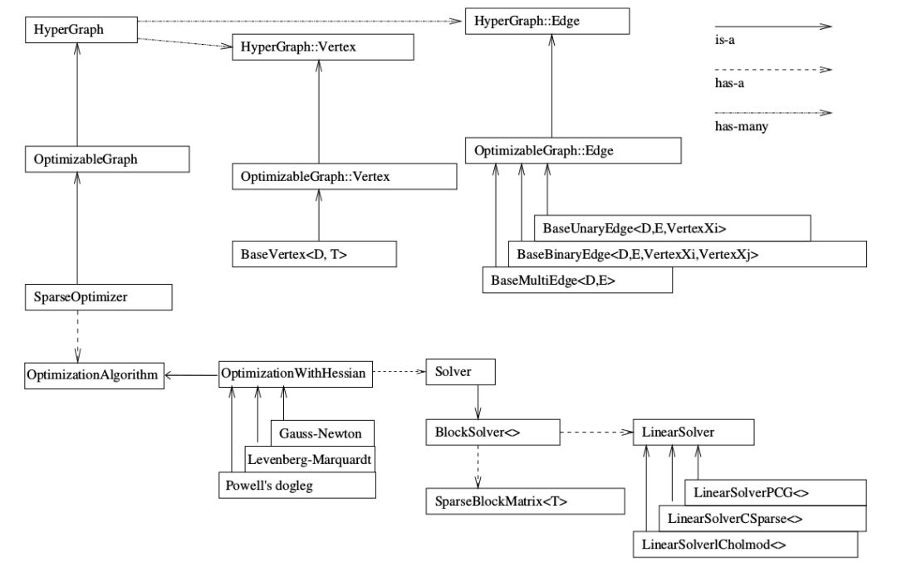

## g2o的基本框架结构

<https://mp.weixin.qq.com/s?__biz=MzIxOTczOTM4NA==&mid=2247486992&idx=1&sn=ecb7c3ef9bd968e51914c2f5b767428d&chksm=97d7eb87a0a062912a9db9fb16a08129f373791fd3918952342d5db46c0bc4880326a7933671&cur_album_id=1361700104461467649&scene=189#wechat_redirect>

边通常表示误差项
来优化非线性误差函数的c++框架
